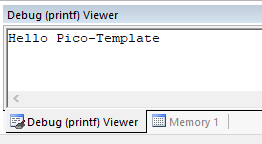
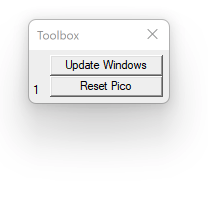
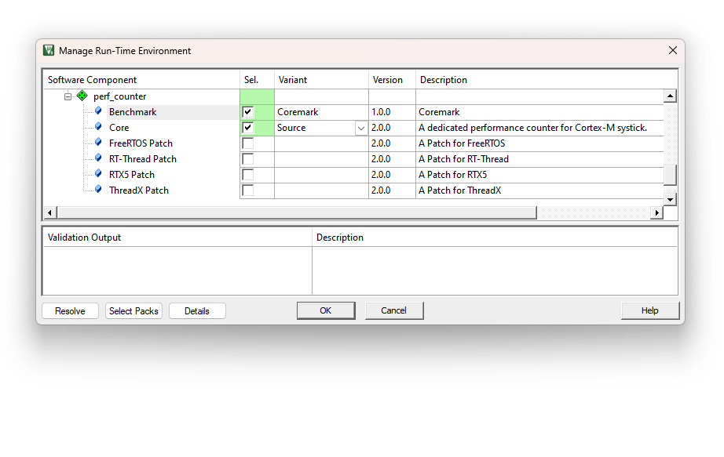
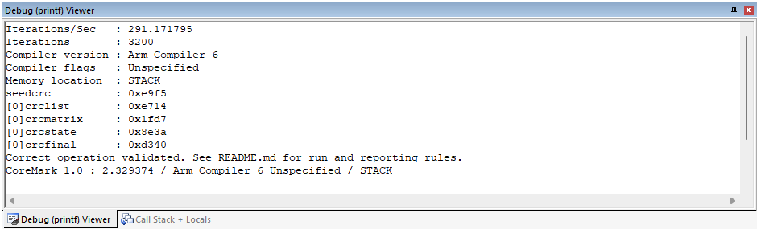
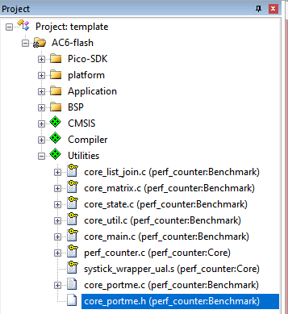

# Pico_Template (v2.3.2)
An MDK template for Tufty2040

- Use RPi official [RP2xxxx_DFP](https://www.keil.arm.com/packs/rp2xxx_dfp-raspberrypi/boards/)
- Add Flash Programming algorithm.

  - Special thanks to [Aladdin-Wang](https://github.com/Aladdin-Wang). [His extraordinary work](https://github.com/Aladdin-Wang/RP2040_Flash_Algorithm) makes our life much easier!
  - Special thanks to [fang316](https://github.com/fang316), whose suggestion improves how the flash programming algorithm is deployed.
- Compiler: Arm Compiler 6.15 and above (Using non-intrusive wrapper to support pico-sdk which is written in GCC)
- Improved BSP support

- **Ready for running [Arm-2D](https://github.com/ARM-software/Arm-2D) benchmarks**
- **Ready for coremark**
- **Support Debug in MDK**

  - [Using CMSIS-DAP](https://github.com/majbthrd/pico-debug) (Validated in MDK and **highly recommended**)
  - **Support Flash Downloading**
- Add dedicated project configurations for:
  - [**AC6-flash**] Running code in Flash (XIP)

  - [**AC6-DebugInSRAM**] "no_flash" mode in the original pico-sdk.


# 1 How to Use

The MDK project could be found in the path "ROOT\project\mdk". I assume you know how to use MDK for normal compilation. 

### 1.1 How to set the Stack and Heap size

Usually, people want to adjust the size of stack and heap, and it is very easy in this template. Please find the file "RP2040.sct" in the same MDK project directory. Find the macro ***STACK_0_SIZE*** for stack and ***HEAP_0_SIZE*** for the heap.  


```
#define STACK_0_SIZE        (1024*4)
#define STACK_1_SIZE        (1024*1)

#define HEAP_0_SIZE         (1024*32)
#define HEAP_1_SIZE         (1024*1)
```

***NOTE***: 

1. Please do **NOT** add "**u**" behind those constant values. 
2. The STACK_1_SIZE and HEAP_1_SIZE are not in use. You can set their value to reasonable smaller ones if you do want to reduce the RAM footprint. 


### 1.2 How to retarget stdout/stdin

To take advantage of pico-sdk, this template uses bridges to retarget low level functions of stdout/stdin to _read and _write implemented by stdio.c inside pico-sdk.  

```
/*----------------------------------------------------------------------------*
 * bridge the Arm Compiler's stdio and the pico-sdk's stdio                   *
 *----------------------------------------------------------------------------*/
__attribute__((weak))
int stdin_getchar(void)
{
    /*! \note If you don't want to use pico-sdk stdio, then you can implement 
     *!       function by yourself in other c source code. Your scanf will work
     *!       directly.
     *!       by default, we use this function to bridge the _read implemented 
     *!       in stdio.c of pico-sdk
     */
    
    int byte;
    _read(0, (char *)&byte, 1);
    return byte;
}

__attribute__((weak))
int stdout_putchar(int ch)
{
    /*! \note If you don't want to use pico-sdk stdio, then you can implement 
     *!       function by yourself in other c source code. Your printf will work
     *!       directly.
     *!       by default, we use this function to bridge the _write implemented 
     *!       in stdio.c of pico-sdk
     */
    
    return _write(1, (char *)&ch, 1);
}

```

Those bridge functions are decorated as "weak", hence if you want to retarget ***printf/scanf*** directly to a place where you can "***see through***" and/or ***you have total control***, please implement those bridge functions (without delete the weak version) in one of your c source code, for example, sending chars to USART or storing them to a memory block directly. 

**NOTE**: I try to provide you the freedom of choice, and I don't need you to digging deep inside scripts to gain such freedom. 


When using configuration**AC6-DebugInSRAM-printf**, all ***printf*** output is retargeted to '**Debug (printf) Viewer**' inside MDK (as shown below) with the help from EventRecorder.

 


### 1.3 How to debug using pico-debug (CMSIS-DAP)

[Pico-debug](https://github.com/majbthrd/pico-debug) is an open-source project which turns one Cortex-M0+ core in RP2040 into a CMSIS-DAP adapter. It means that without an extra one, you can debug a Pico in MDK with just one USB connector. In order to do so, please [download the latest uf2 file](https://github.com/majbthrd/pico-debug/releases) first.


Pico-Template provides a dedicated project configuration for downloading and debugging code in SRAM. This is the most convenient one and it delivers the best development experience among the three configurations. To use it, please follow the steps below:

1. Boot the Pico with the **BOOTSEL** button pressed. 
2. Drag and drop **pico-debug-gimmecache.uf2** to RPI-RP2 mass-storage driver in the explorer. It immediately reboots as a **CMSIS-DAP adapter**. Pico-debug loads as a RAM only `.uf2` image, meaning that it is never written to flash and doesn't replace existing user code.
3. Compile and Debug
5. Enjoy...

**NOTE: **

**1. In this mode, the "RESET" doesn't really work as we expect. If you do want to RESET, please press the "Reset Pico " button shown below:**

 

**2. If you cannot find this Toolbox, please start your debug session and go to menu "View"->"Toolbox Window".**


### 1.4 How to run Coremark

With the help from `perf_counter v2.0.0` , we can now run **[coremark](https://github.com/eembc/coremark)** on Pico-Template with just one click in RTE as shown below:

 

A code in `main()` will run the coremark after that:

```c
int main(void) 
{
    system_init();

    printf("Hello Pico-Template\r\n");
    
    ...

#if defined( __PERF_COUNTER_COREMARK__ ) && __PERF_COUNTER_COREMARK__
    printf("\r\nRun Coremark 1.0...\r\n");
    coremark_main();
#endif
    ...
    
    while (true) {
        ...
    }
}
```

By default, you can observe the test result in **Debug (printf) View** as shown below:

 


**NOTE**: **The coremark has to run at least 10 secs to generate a valid result**. Fail to do so,  you can change the macro `ITERATIONS` defined in `core_portme.h` to a bigger value and try again.

 


